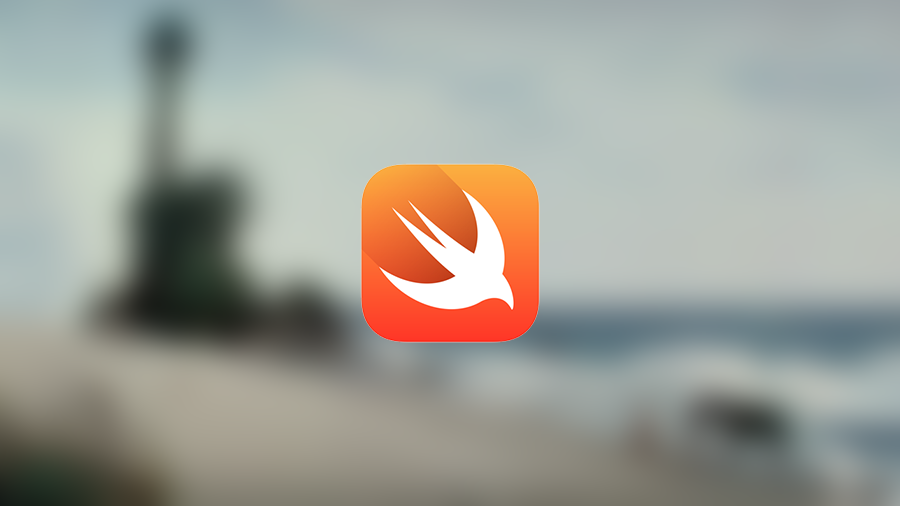
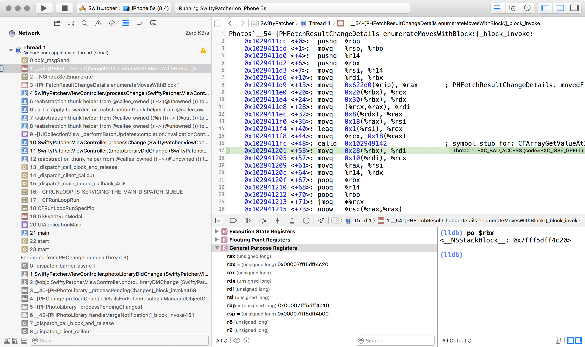
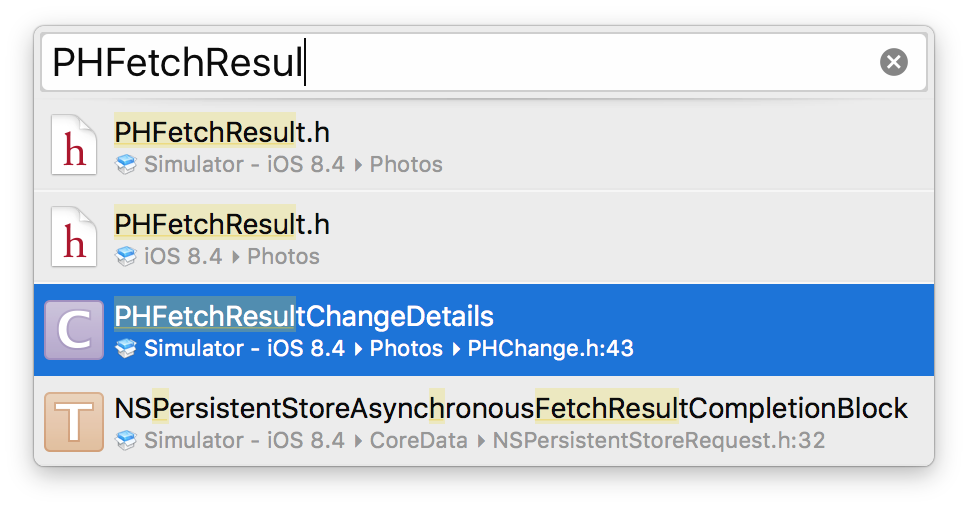
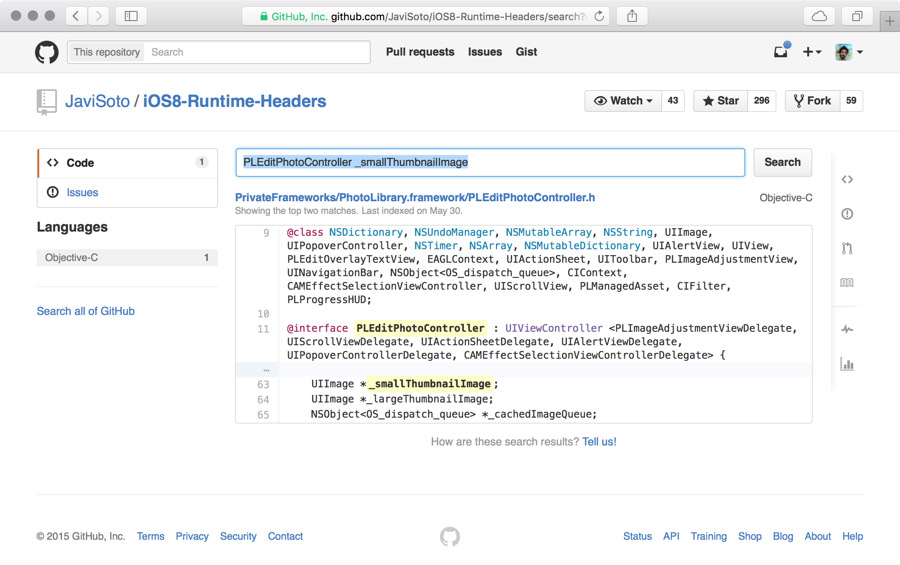
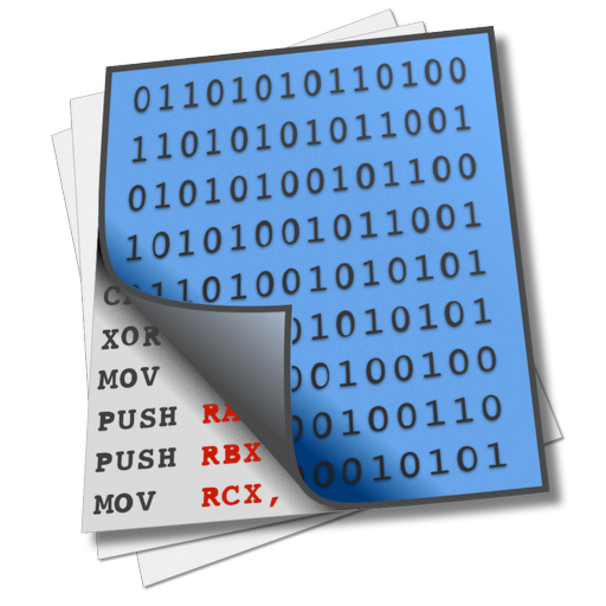
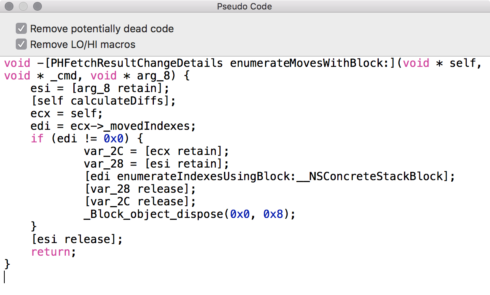
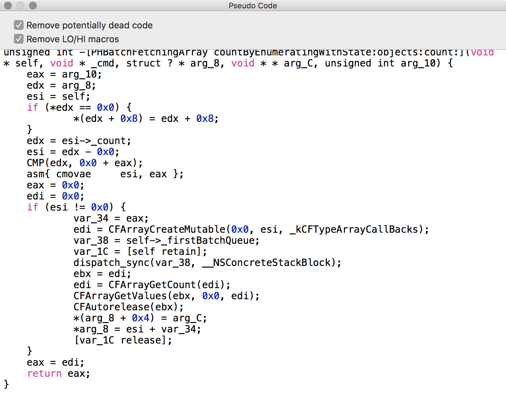
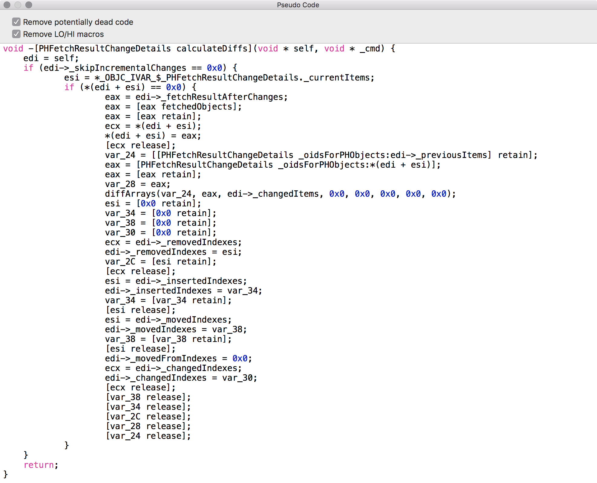
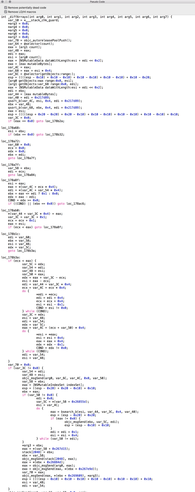
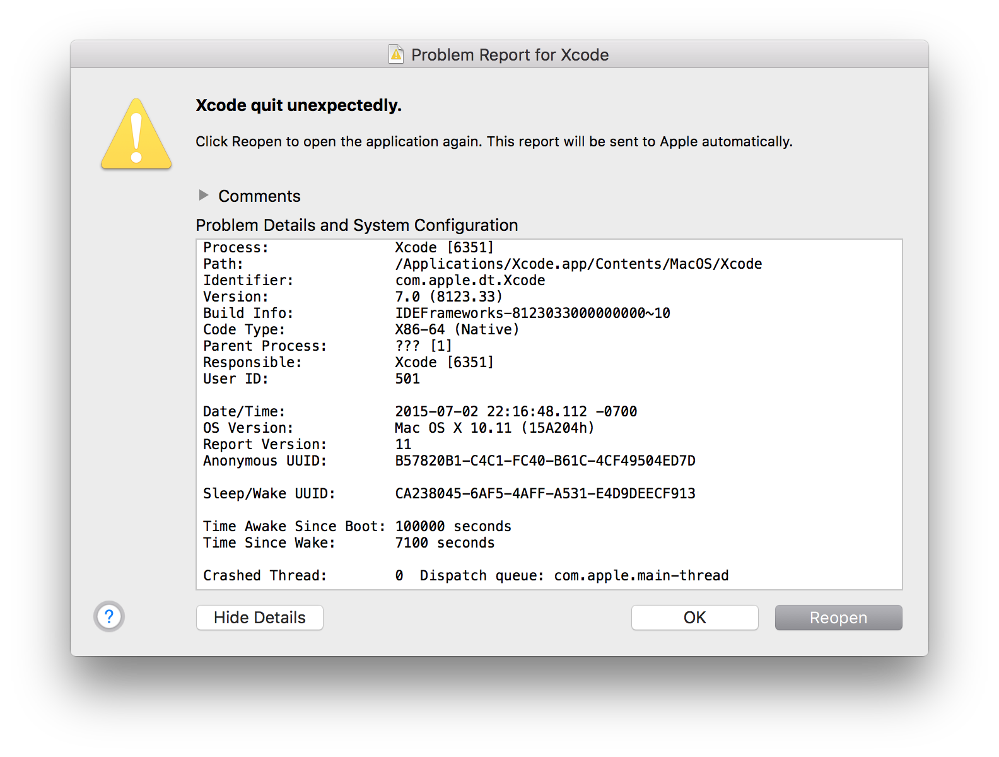

^ My talk is about fixing problems in 3rd-party code

---

# Intro


^ This is me for the past 2 years, until...

---

# Intro 


^ This happened 3 days ago.

^ Yeah...

^ I'm still trying to get a hairdresser appointment 

---

# Intro


^ 5 years ago, I left Russia and moved to Israel...

---

# Intro


^ 5 months ago, I moved to the States.

^ As you might've guessed, I like changes.

---



^ When Swift came out I was really excited. A new language to play with!

^ But let's focus on Swift background for a second.

---


^ Swift, the way we run it today, carries a big legacy.

^ It has a very familiar foundation: Cocoa (Touch or not)

^ So what's the ratio between 1st party frameworks written in Swift vs Objective-C? 

---

```ruby
#!/usr/bin/ruby

developers_dir = `xcode-select -p`.chomp
frameworks_dir = "#{developers_dir}/Platforms/iPhoneSimulator.platform"
frameworks_dir += "/Developer/SDKs/iPhoneSimulator.sdk/System/Library/Frameworks/*"
swift_frameworks_count = 0
Dir[frameworks_dir].each { |file| 
	framework = "#{file}/#{File.basename(file, ".*")}"
	next unless File.exist?(framework)
	puts framework unless `otool -l #{framework} | grep -i swift`.empty?
}
```

^ This is a script that goes through all Apple's frameworks and prints the ones that are built with Swift.

^ Let's take a look at the result:

---

# System frameworks built with Swift[^1]


[^1]: This slide is intentionally left blank

^ This is the list of system frameworks built with Swift

^ It means we have to learn to co-exist with these "legacy" frameworks.

^ Co-exist in this case also means to work around bugs found in this frameworks. Why?

---

# It's not my fault


^ Your users don't care if it's Apple's fault.

^ They don't even know what `radar` is. 

^ Apple doesn't share the bugfix roadmap, so it is up to us to workaround existen bugs in the meantime.

^ Let's take a look at what we might have to deal with.

---

# Demo: UIKitty


^ Let's start with something simple: visual bugs.

^ Sadly, I don't have a real-life example.

^ Let's take a look at UIKitty. It's like Instagram but for sharing a single picture of a cat.

^ `D E M O`

---

```swift
if let cls: AnyClass = NSClassFromString("UIPrinterSearchingView") {
    let block: @objc_block (AspectInfo) -> Void = { (aspectInfo) in
        if let view = aspectInfo.instance() as? UIView {
            view.frame.size.height = view.superview!.frame.height - 44
        }
    }
	let blockObject = unsafeBitCast(block, AnyObject.self)
    (cls as AnyObject).aspect_hookSelector(
    	Selector("layoutSubviews"), 
    	withOptions: .PositionAfter, 
    	usingBlock: blockObject, 
    	error: nil
    )
}
```

^ First let's make sure the class exists

^ Then our patch is simply calculates the right height

^ Lastly, we make sure it's called every time `layoutSubviews` has been called on the original view

---

# Swizzling

0. Swizzling is still possible in Swift.
0. Aspect oriented programming.
0. Set applicable OS versions for the patch.
0. Test extensively. On device!

^ Basically, swizzling is replacing methods during runtime without callers knowing that you swapped the implementation.

^ 1. You can swizzle 3rd party frameworks, even with `-O` enabled

^ 2. When you want to apply a hack across all the 

^ 3. Transition like iOS 6 - iOS 7 might easily break your patches, minor version are probably fine.

^ 4. Certain features are implemented differently on simulator and device. Always test on real device!


---

# Organizer


^ The next example is my friend's app, called Organizer.

^ The app allows you to adjust photos meta information. It was made clear that even internal Apple QA uses it.

^ This app is built on top of `Photos.framework`.

---

# Demo: Organizer


^ Photos framework allows to observe photo library changes and animate it in UI.

^ The problem is that every time library was changing the app would crash.

^ A bit of a problem for the app that changes your photo library.

^ `D E M O`

---



^ I just wanted to underline that the demo code is not from the actual app but from the sample on Apple's website. It actually crashes on iOS 8, every time you run it.

^ So let's talk about finding where did the symbols come from?

^ As you noticed on the screenshot, you can see both the class and the method name.

---



^ First, try your luck with public symbols

^ Simply look it up using Quick Open (⌘⇧O)

---



^ If that gave you no results, it must be a private symbol.

^ Try any of iOS header dump repositories on Github. The benifit is that you can see it gives you the framework name straight away.

^ Worst case, just Google it. I mean we're developers after all, that's what we do: google code snippets and copy them from stack overflow.

---

# Hopper Disassembler



^ I want to mention what an awesome tool Hopper Disassembler is. If you're curious about the implementation details, definitely check it out!

^ When you know where the symbol is coming from, load the framework into Hopper Disassembler.

---


^ Open the framework you found and search for the name of the method.

^ All symbols are listed on the left, implementation is on the right.

^ If you have troubles reading disassembly, as any normal human being should, there is a button that generates pseudo code.

---



^ And turns disassembly into a more readable mix of Objective-C with C with assembly :|

^ This is where you spend most of the time digging through the method implementations, following method calls getting...

---



^ ...further...

------



^ ...and further...

---



^ ...and further...

---

```c
diffArrays(var_24, eax, edi->_changedItems, nil, nil, nil, nil, nil);

void diffArrays(NSArray <NSManagedObject *> *arg0,
                NSArray <NSManagedObject *> *arg1,
                NSArray <NSManagedObject *> *arg2,
                NSIndexSet **arg3,
                NSIndexSet **arg4,
                NSIndexSet **arg5,
                NSArray <NSManagedObject *> **arg6,
                NSIndexSet **arg7);
```

^ Until you find the function call that actually causes troubles.

^ In this particular case it is a static C function, so we can not apply swizzling from the previous example.

^ This method that takes CoreData objects, representing your photo library and returns permutations of IndexSets for deletion, insertion or simply moving the pictures around.

^ By the way, how do you like neat Objective-C generics syntax? Especially `arg6`.

^ Now the easiest part...

---

# The easiest part


^ To figure out what is crashing

^ Now this is a tedious process and there is no recipe. Same as debugging unfamiliar codebase.

^ `D E M O` of working patch & code

---


```swift
// Internal structures
struct swift_func_wrapper {
    var trampolinePtr: UnsafeMutablePointer<uintptr_t>
    var functionObject: UnsafeMutablePointer<swift_func_object>
}
struct swift_func_object {
    var original_type_ptr: UnsafeMutablePointer<uintptr_t>
    var unknown: UnsafeMutablePointer<UInt64>
    var address: uintptr_t
    var selfPtr: UnsafeMutablePointer<uintptr_t>
}

// Method we want to call
func hello(world: String) -> Void
typedef helloFn = (String) -> Void

// C function pointer
let fn = UnsafeMutablePointer<helloFn>.alloc(1)
fn.initialize(hello)
let fnWrapper = UnsafeMutablePointer<swift_func_wrapper>(fn)
let opaque = COpaquePointer(bitPattern: fnWrapper.memory.functionObject.memory.address)
let cFunction = CFunctionPointer<helloFn>(opaque)
```

---

```swift
// Internal structures

struct swift_func_wrapper {
    var trampolinePtr: UnsafeMutablePointer<uintptr_t>
    var functionObject: UnsafeMutablePointer<swift_func_object>
}

struct swift_func_object {
    var original_type_ptr: UnsafeMutablePointer<uintptr_t>
    var unknown: UnsafeMutablePointer<UInt64>
    var address: uintptr_t
    var selfPtr: UnsafeMutablePointer<uintptr_t>
}
```

---

```swift
// Method we want to call

func hello(world: String) -> Void {
	print("Hello, \(world)")
}

typedef helloFn = (String) -> Void
```

---

```swift
// C function pointer

let fn = UnsafeMutablePointer<helloFn>.alloc(1)
fn.initialize(hello)
let fnWrapper = UnsafeMutablePointer<swift_func_wrapper>(fn)
let address = fnWrapper.memory.functionObject.memory.address
let opaque = COpaquePointer(bitPattern: address)
let cFunction = CFunctionPointer<helloFn>(opaque)
```

---

# C-functions patching

* Figure out parameter types.
* Patch implementation.
* Call the original implementation maybe?
* Use fishhook - dynamically rebinding symbols in Mach-O binaries.

---

# Conclusions

* Objective-C + swizzling = :sparkling_heart:
* C functions[^2] + fishhook = :rainbow:
* Swift + optimization `-O` = :poop:

[^2]: calling `IMP` directly from Swift might be possible with `@convention` syntax

---

# Credits

* Perceptual Debugging @kendalldevdiary 
* [Reverse Engineering](http://samdmarshall.com/re.html) @Dirk_Gently
* [Unsafe Swift: For Fun & Profit](https://realm.io/news/russ-bishop-unsafe-swift/) @xenadu02
* [Peter Steinberger's blog](http://petersteinberger.com) by @steipete
* [All WWDC sessions about debugging](https://developer.apple.com/videos/) by @apple
* [Aspects](https://github.com/steipete/Aspects) by @steipete, [fishhook](https://github.com/facebook/fishhook) by @facebook

^ 1. Sadly not online yet, explains on how to speed up the process of debugging.
2. A nice overview of reverse engineering tools
3. How to be careful with swift. Also make sure to read Russ Bishop's blog - it is fascinating 
4. Takes good care of his customers by patching Apple's bugs.

--- 



@zats

---

# Questions?


