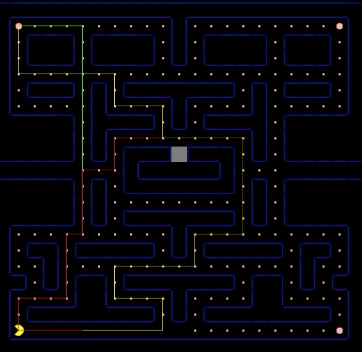
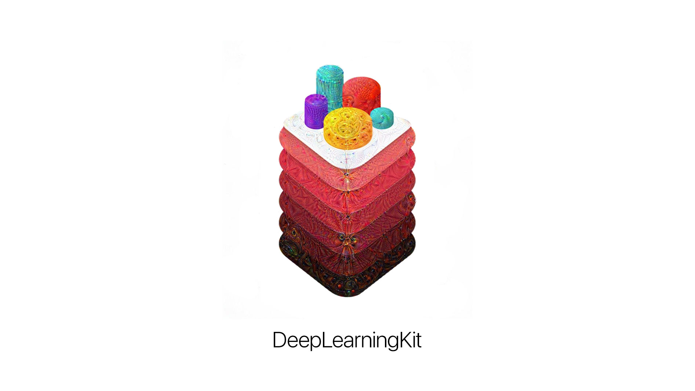

# GameplayKit: beyond games

^ This is a talk about GameplayKit

<!-- ---

# != gamification


^ Gamification of apps is a separate, somewhat controversial, topic.

---

# Repurposing


^ Right after WWDC I thought to myself: GameplayKit - so many awesome tools. Would be cool to be able to apply it to regular apps, not games.
 -->
---

# General goodies

* Components & Entities
* Random Numbers
* State Machine

---

# Components & Entities: Inheritance


^ A typical problem with inheritance (remember `NSOrderedSet` is not a subclass of `NSSet`?)

---

# Components & Entities: Composition


^ Instead

---

# Components & Entities


^ Why is it good? Well, next time you're about to create one of these, consider composition.

---

# Random numbers

## Distributions:
Standard, Shuffled, Gaussian

## Sources:
Mersenne Twister, Arc4, Linear Congruential

---

# State Machine

* Disclaimer: The "S" word.

* "GameplayKit: State Machine for non-game Apps" [invasivecode.com/weblog/gameplaykit-state-machine](https://www.invasivecode.com/weblog/gameplaykit-state-machine)  by [@vicentevicens](https://twitter.com/vicentevicens)

^ If you have no choice, it is there for you. Why is it bad? NEXT

---

# State Machine: 101


^ It always starts pretty trivial. You can easily reason about the transitions and possible states... NEXT

---

# State Machine: 102[^1]


[^1]: How are video game AIs programmed? Is it a just a long series of "If Then" statements? [reddit.com/r/explainlikeimfive/comments/2r6g74/eli5_how_are_video_game_ais_programmed_is_it_a/?limit=500](https://www.reddit.com/r/explainlikeimfive/comments/2r6g74/eli5_how_are_video_game_ais_programmed_is_it_a/?limit=500)

^ Remember that state complexity grows exponentially because of all possible permutations.

^ There is a monster thread on reddit. I don't know if you can see it, but there is a "limit=500" in the URL. It is there for a reason ;)

---

# Markov Chains


---

# Markov Chains

Modeling weather conditions, simulating stock exchange


---

## Demo
# SwiftDoc.org: Swift 3.0

---

```swift
class MarkovChainMachine: GKStateMachine {
    let outcomesMap: [[GKState]: [Double: GKState]]
    var buffer: [GKState]

    func enterNextState() {
    	let next = nextState()
    	enterState(next)
    	buffer.removeFirst()
    	buffer.append(next)
    }

    func nextState() -> GKState {
    	let random = ...
    	return nextState(buffer, random)
    }
}
```

---

# MinMax

* Widely used in turn-by-turn games
* Applicable for 1+ player
* Increasing depth of prediction increases the computation time exponentially
* Alpha-beta pruning and other algorithms to speed up calculation

---

## Demo
# Sol: a Smart(er) Weather App

^ The original app is a simple weather app, let's enhance it with some AI.

---

  

^ Switch to demo

---

# MinMax

```swift
suggestions.register(AddCity.self) { history in
	switch history.filter({ $0 is AddCity }).count {
	case 0:
		return best
	case 1..<3:
		return good + 1
	default:
		return nil
	}
}
```

---

# MinMax

```swift
var history: [GKState]

// GKGameModel
func scoreForPlayer(player: GKGameModelPlayer) -> Int {
    var maxScore = Int.min
    for predicate in predicates {
        if let result = predicate.score(history: history) {
            if maxScore < result {
               maxScore = result
            }
        }
    }
    return maxScore
}
```

---

# Pathfinding



^ Family of algorithms finding most optimal path connecting two nodes in a graph

^ Used by Pacman, Starcraft etc

---

# Pathfinding


^ Few years ago this guy used A* to "solve" Super Mario.

^ Red lines show all possible paths, they are smoothed edges between all possible vertices.

^ Spoiler: he gets the highest score at the end

---

## Demo
# In App Navigation

---

# Pathfinding

```swift
func setupGraph() {
    root.addConnectionsToNodes([privacy, facebook], bidirectional: true)
    facebook.addConnectionsToNodes([facebookSettings, facebookAccount], bidirectional: true)
    facebookSettings.addConnectionsToNodes([facebookLocation], bidirectional: true)
    privacy.addConnectionsToNodes([bluetooth, location], bidirectional: true)
    location.addConnectionsToNodes([facebookLocation], bidirectional: true)
    
    graph.addNodes([ 
    	root, privacy, facebook,
        bluetooth, location,
        facebookSettings, facebookLocation, facebookAccount
    ])

	favorite = facebookLocation
}
```

---

# Pathfinding

```swift
func goToFavoriteNode() {
	let current = currentViewController.node
	let path = root.findPathFromNode(current, toNode: favorite)
	navigate(path)
}
```

---



---

# GameplayKit: beyond games

* GameplayKit reimplemented [github.com/mohiji/JLFGameplayKit](https://github.com/mohiji/JLFGameplayKit)
* This presentation [github.com/zats/Presentations](https://github.com/zats/Presentations)
* @zats

> Thank you!
